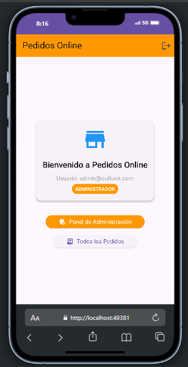
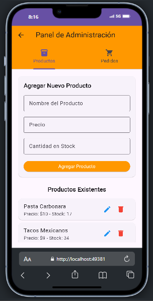
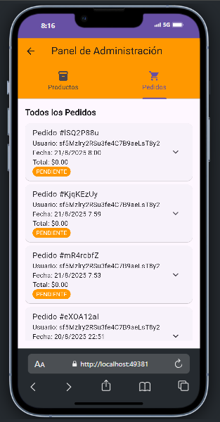
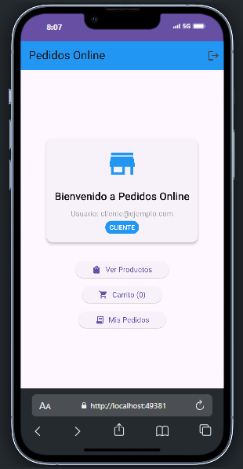
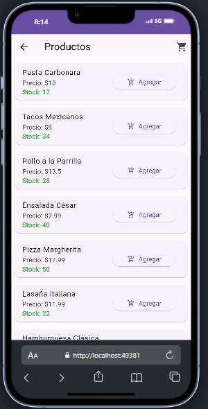
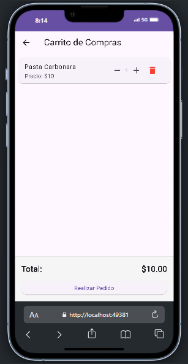
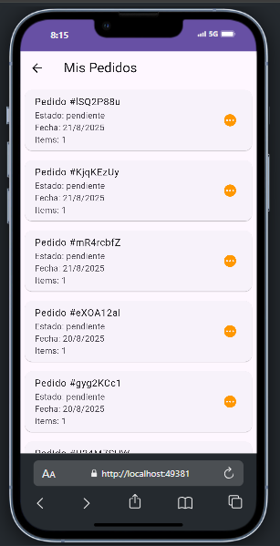

# App Pedidos - Sistema de Pedidos Online

Una aplicación Flutter para gestión de pedidos con roles diferenciados (Admin/Cliente) y integración con Firebase.

## 🚀 Características

### 👨‍💼 Administrador



- **Panel de Administración**: Agregar, editar y eliminar productos



- **Gestión de Stock**: Control automático de inventario
- **Ver Todos los Pedidos**: Supervisión completa de pedidos



### 🛒 Cliente



- **Catálogo de Productos**: Navegación intuitiva con información de stock



- **Carrito de Compras**: Agregar productos y gestionar cantidades



- **Mis Pedidos**: Historial personal de pedidos realizados



### 🔧 Funcionalidades Técnicas
- **Autenticación Firebase**: Registro y login seguro
- **Base de Datos Firestore**: Almacenamiento en tiempo real
- **Actualización Automática de Stock**: Transacciones atómicas
- **Roles Diferenciados**: Sistema de permisos por usuario
- **Validación de Stock**: Prevención de pedidos sin inventario

## 📋 Requisitos Previos

- Flutter SDK (>=3.0.0)
- Dart SDK (>=3.0.0)
- Android Studio / VS Code
- Cuenta de Firebase

## ⚙️ Configuración

### 1. Clonar el Repositorio
```bash
git clone https://github.com/adamchoquetarqui/Actividad4_AplicacionesMoviles.git
cd App_pedidos
```

### 2. Instalar Dependencias
```bash
flutter pub get
```

### 3. Configurar Firebase

**⚠️ IMPORTANTE: Los archivos de configuración de Firebase NO están incluidos por seguridad.**

Debes crear tu propio proyecto Firebase y configurar:

1. **Crear proyecto en [Firebase Console](https://console.firebase.google.com)**

2. **Habilitar servicios:**
   - Authentication (Email/Password)
   - Firestore Database
   - (Opcional) Analytics

3. **Descargar archivos de configuración:**
   - `android/app/google-services.json` (Android)
   - `ios/Runner/GoogleService-Info.plist` (iOS)

4. **Generar firebase_options.dart:**
```bash
flutterfire configure
```

### 4. Configurar Firestore

1. **Reglas de Seguridad** (Firestore Database → Rules):
```javascript
rules_version = '2';
service cloud.firestore {
  match /databases/{database}/documents {
    match /{document=**} {
      allow read, write: if request.auth != null;
    }
  }
}
```

2. **Crear Índices Compuestos** (Firestore Database → Indexes):
   - Collection: `pedidos`, Fields: `fecha` (Descending)
   - Collection: `pedidos`, Fields: `id_usuario` (Ascending) + `fecha` (Descending)

## 🚀 Ejecutar la Aplicación

```bash
flutter run
```

## 📱 Uso de la Aplicación

### Primer Usuario Admin
Para crear el primer usuario administrador:

1. Registra un usuario normal
2. Ve a Firestore Console → Collection `users`
3. Encuentra tu usuario y cambia `role: "admin"`

### Estructura de Datos

**Usuarios (`users`):**
```json
{
  "uid": "string",
  "email": "string", 
  "role": "admin|cliente",
  "displayName": "string",
  "createdAt": "timestamp"
}
```

**Productos (`products`):**
```json
{
  "name": "string",
  "price": "number",
  "quantity": "number"
}
```

**Pedidos (`pedidos`):**
```json
{
  "id_usuario": "string",
  "fecha": "timestamp",
  "estado": "pendiente",
  "items": [
    {
      "productId": "string",
      "name": "string", 
      "price": "number",
      "quantity": "number",
      "total_price": "number"
    }
  ]
}
```

## 🔒 Seguridad

- Archivos de configuración Firebase excluidos del repositorio
- Reglas de Firestore requieren autenticación
- Validación de roles en cliente y servidor
- Transacciones atómicas para consistencia de datos

## 🛠️ Tecnologías Utilizadas

- **Flutter** - Framework de desarrollo
- **Firebase Auth** - Autenticación
- **Cloud Firestore** - Base de datos
- **Provider/Singleton** - Gestión de estado

## 📄 Licencia

Este proyecto es para fines educativos.
